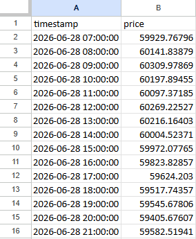
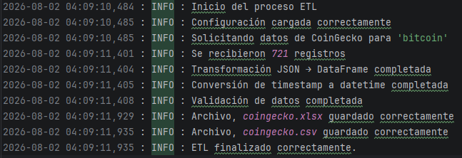

# 🚀 Crypto-ETL Pipeline

> **Pipeline ETL modular en Python para la extracción, transformación, validación y carga de datos cripto, generando archivos CSV y Excel listos para análisis.**


---

## 📖 Descripción

Crypto-ETL es un pipeline ETL modular que consume datos desde una API pública, los transforma, valida y exporta en archivos CSV y Excel listos para su análisis. La arquitectura separa cada etapa del proceso (Extract, Transform, Validate y Load), utiliza configuración externa mediante `config.json`, registra la ejecución con un sistema de logging y maneja errores de forma centralizada para facilitar su mantenimiento y escalabilidad.

---
## 📊 ETL Output
El pipeline genera automáticamente un archivo Excel listo para análisis.



*Ejemplo del archivo generado por el proceso ETL.*

---
## ⚡ Características Implementadas

- ✅ **Arquitectura Modular:** Separa las etapas Extract, Transform, Validate y Load para facilitar el mantenimiento y la escalabilidad.
- ✅ **Configuración externa mediante config.json:** Permite modificar parámetros del ETL sin cambiar el código fuente.
- ✅ **Validación automática de datos:** Verifica que los datos no estén vacíos y detecta valores nulos antes de la exportación.
- ✅ **Manejo centralizado de errores:** Captura excepciones y registra información útil para facilitar el diagnóstico.
- ✅ **Sistema de logging integrado:** Registra cada etapa del ETL para facilitar el seguimiento y diagnóstico.
- ✅ **Exportación en múltiples formatos (CSV y Excel):** Genera archivos CSV y Excel listos para su análisis.

---

## 🛠️ Tecnologías Utilizadas

- **Lenguaje:** Python 3.x
- **Consumo de API:** Requests
- **Manipulación de Datos:** Pandas
- **Exportación:** CSV (Pandas) y Excel (OpenPyXL)
- **Configuración:** Archivo `config.json`
- **Logging:** Módulo `logging` de Python

---

## 📂 Estructura del Proyecto
```text
crypto-etl/
│
├── README.md               # Documentación del proyecto
├── requirements.txt        # Dependencias
├── config.json             # Configuración del ETL
│
├── src/                    # Código fuente
│   ├── main.py             # Orquestador del pipeline
│   ├── extract.py          # Extracción desde la API
│   ├── transform.py        # Transformación de datos
│   ├── validate.py         # Validación de datos
│   └── load.py             # Exportación a CSV y Excel
│
├── data/
│   ├── raw/                # Datos sin procesar
│   └── processed/          # Archivos generados por el ETL
│
└── logs/                   # Registros de ejecución

````
---
# 🚀Cómo Ejecutar
Follow the steps below to run the ETL pipeline locally:

## 1. Clonar el repositorio
git clone https://github.com/MatiasSegovia/crypto-etl
cd crypto-etl

## 2. (Opcional) Crear entorno virtual
python -m venv venv
source venv/bin/activate  # En Windows: venv\Scripts\activate

## 3. Instalar dependencias
pip install -r requirements.txt

## 4. Configurar parámetros
## Edita config.json para definir la criptomoneda, la moneda de referencia y la cantidad de días que deseas consultar.)

## 5. Ejecutar el pipeline
python src/main.py

---
## 📸 Pipeline Execution

Al ejecutar el pipeline, cada etapa queda registrada mediante un sistema de logging para facilitar el monitoreo y la depuración.



*Ejemplo real de una ejecución exitosa del pipeline.*

---


# 📊 Resultado del ETL

Al finalizar la ejecución, el pipeline genera automáticamente:

````
data/
└── processed/
    ├── coingecko.csv
    └── coingecko.xlsx
````
# 🚀 Future Improvements

Este proyecto continuará evolucionando incorporando nuevas herramientas y prácticas utilizadas en entornos profesionales de Data Engineering.

- 📊 Registro de métricas del pipeline: tiempo de ejecución y cantidad de registros procesados por cada etapa.
- 🗄️ **Integración con PostgreSQL:** Exportar los datos directamente a una base de datos relacional.
- ⏰ **Orquestación con Apache Airflow:** Automatizar la ejecución y planificación del pipeline.
- 🐳 **Dockerización:** Contenerizar el proyecto para facilitar su despliegue en cualquier entorno.
- 🧪 **Pruebas automatizadas con pytest:** Incorporar tests unitarios para cada módulo del ETL.
- 🔔 **Sistema de alertas:** Enviar notificaciones por Slack o correo electrónico ante errores del pipeline.
- 📈 **Dashboard de monitoreo:** Visualizar métricas de ejecución y estado del ETL.
- 🔌 **Soporte para múltiples APIs:** Integrar proveedores como CoinGecko, Binance y Kraken en un mismo pipeline.